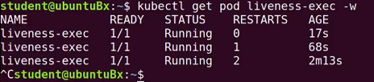
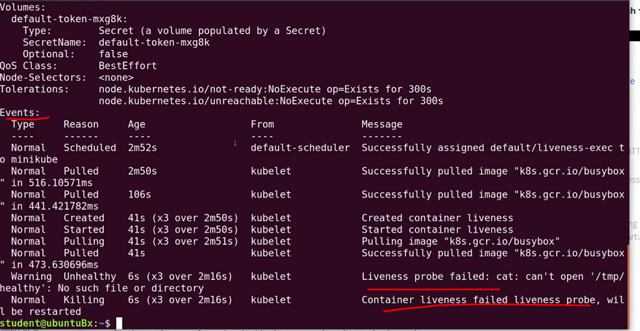

# K8s-Liveness-Readiness-and-Startup-Probes.

While containerized applications are scheduled to run in pods on nodes across our cluster, at times the applications may become unresponsive or may be delayed during startup. Implementing Liveness and Readiness Probes allows the kubelet to control the health of the application running inside a Pod's container and force a container restart of an unresponsive application.

## Liveness

If a container in the Pod has been running successfully for a while, but the application running inside this container suddenly stopped responding to our requests, then that container is no longer useful to us. This kind of situation can occur, for example, due to application deadlock or memory pressure. In such a case, it is recommended to restart the container to make the application available.

Rather than restarting it manually, we can use a Liveness Probe. Liveness Probe checks on an application's health, and if the health check fails, kubelet restarts the affected container automatically.

Liveness Probes can be set by defining:

Liveness command

Liveness HTTP request

TCP Liveness probe

gRPC Liveness probe

## Liveness Command

```yaml
apiVersion: v1
kind: Pod
metadata:
  labels:
    test: liveness
  name: liveness-exec
spec:
  containers:
  - name: liveness
    image: k8s.gcr.io/busybox
    args:
    - /bin/sh
    - -c
    - touch /tmp/healthy; sleep 30; rm -rf /tmp/healthy; sleep 600
    livenessProbe:
      exec:
        command:
        - cat
        - /tmp/healthy
      initialDelaySeconds: 15
      failureThreshold: 1
      periodSeconds: 5
```

The existence of the /tmp/healthy file is configured to be checked every 5 seconds using the periodSeconds parameter. The initialDelaySeconds parameter requests the kubelet to wait for 15 seconds before the first probe. When running the command line argument to the container, we will first create the /tmp/healthy file, and then we will remove it after 30 seconds. The removal of the file would trigger a probe failure, while the failureThreshold parameter set to 1 instructs kubelet to declare the container unhealthy after a single probe failure and trigger a container restart as a result.

## Demo: Liveness Command

We are running the liveness-exec pod presented on the previous page of this chapter to show how we check the health of an application container using the liveness command.

Let's review the YAML manifest.

```bash
vim probe.yaml
```

```yaml
apiVersion: v1
kind: Pod
metadata:
  labels:
    test: liveness
  name: liveness-exec
spec:
  containers:
  - name: liveness
    image: k8s.gcr.io/busybox
    args:
    - /bin/sh
    - -c
    - touch /tmp/healthy; sleep 30; rm -rf /tmp/healthy; sleep 600
    livenessProbe:
      exec:
        command:
        - cat
        - /tmp/healthy
      initialDelaySeconds: 15
      failureThreshold: 1
      periodSeconds: 5
```

In the manifest, we define a pod that runs a busybox container. The container is configured to create a /tmp/healthy file upon startup, sleep for 30 seconds, then remove the /tmp/healthy file.

The probe is configured to cat the /tmp/healthy file every 5 seconds after an initial delay of 3 seconds.

The first few cat commands will be successful, but once the file is removed by the busybox script after 30 seconds, the probe will fail.

By default, Kubelet would wait to reach the default failure threshold of three consecutive failures before declaring the container unhealthy and restarting it. In our example, the failure threshold property is set to 1, meaning that after a single failed probe, the container is declared unhealthy and it is started or restarted by Kubelet.

So, let's run the pod and then monitor its behavior more precisely, keeping an eye on the number of restarts.


```bash
kubectl create -f probe.yaml
```

There are several commands that can help,


```bash
kubectl get pod liveness-exec -w
```

where the -w flag performs a watch and automatically refreshes the output with every container restart.

Run it once and wait for a few minutes to see the results.



We can also run the kubectl get pod command manually, run it every few minutes or so, or the kubectl describe pod command.

```bash
kubectl describe pod liveness-exec
```



Again, we can run this every minute or so and scroll down to the events section to see both successful and failed scheduling events.

So, in this demo, we learned how to configure a liveness probe with the liveness command, which reacted to an event and triggered a container restart once declared unhealthy.

## Liveness HTTP Request

In the following example, the kubelet sends the HTTP GET request to the /healthz endpoint of the application, on port 8080. If that returns a failure, then the kubelet will restart the affected container; otherwise, it would consider the application to be alive:

```yaml
...
     livenessProbe:
       httpGet:
         path: /healthz
         port: 8080
         httpHeaders:
         - name: X-Custom-Header
           value: Awesome
       initialDelaySeconds: 15
       periodSeconds: 5
...
```

## TCP Liveness Probe

With TCP Liveness Probe, the kubelet attempts to open the TCP Socket to the container running the application. If it succeeds, the application is considered healthy, otherwise the kubelet would mark it as unhealthy and restart the affected container.

```yaml
...
    livenessProbe:
      tcpSocket:
        port: 8080
      initialDelaySeconds: 15
      periodSeconds: 5
...
```

## gRPC Readiness Probe

The gRPC Liveness Probe can be used for applications implementing the gRPC health checking protocol. It requires for a port to be defined, and optionally a service field may help adapt the probe for liveness or readiness by allowing the use of the same port.

```yaml
...
    livenessProbe:
      grpc:
        port: 2379
      initialDelaySeconds: 10
...
```

## Readiness Probes

Sometimes, while initializing, applications have to meet certain conditions before they become ready to serve traffic. These conditions include ensuring that the dependent service is ready, or acknowledging that a large dataset needs to be loaded, etc. In such cases, we use Readiness Probes and wait for a certain condition to occur. Only then, the application can serve traffic.

A Pod with containers that do not report ready status will not receive traffic from Kubernetes Services.


```bash
...
    readinessProbe:
          exec:
            command:
            - cat
            - /tmp/healthy
          initialDelaySeconds: 5 
          periodSeconds: 5
...
```
Readiness Probes are configured similarly to Liveness Probes. Their configuration fields and options also remain the same. Readiness probes are also defined as Readiness command, Readiness HTTP request, TCP readiness probe, and gRPC readiness probe.

Please review the Readiness Probes for more details.

## Startup Probes

The newest member of the Probes family is the Startup Probe. This probe was designed for legacy applications that may need more time to fully initialize and its purpose is to delay the Liveness and Readiness probes, a delay long enough to allow for the application to fully initialize.
